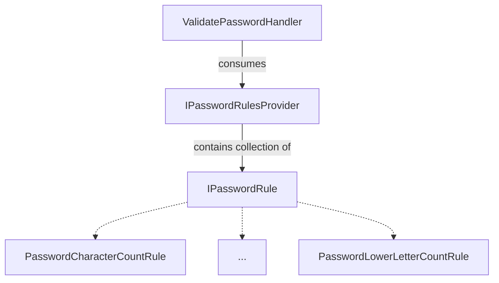
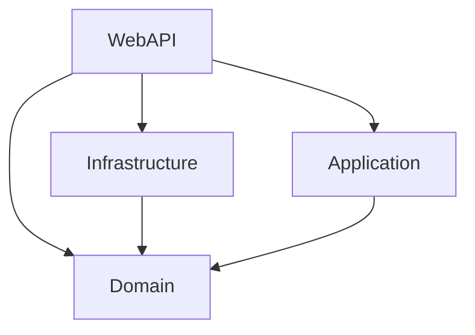
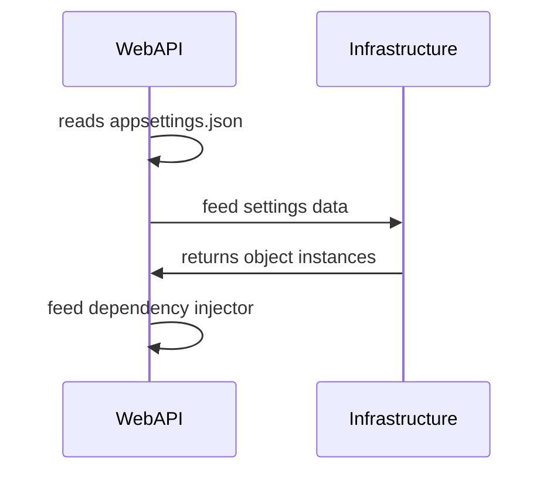
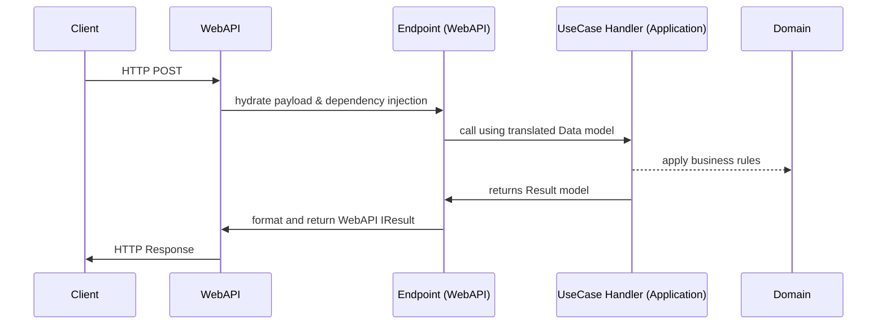

# Interplayers Password Validator
Exemplo de código aplicando conceitos de arquitetura e testes automatizados.

## Execução
```
git clone https://github.com/vqalves/interplayers-password-validator.git
cd interplayers-password-validator
dotnet run --project Interplayers.WebAPI
```

```
POST http://localhost:5000/validate-password

Headers:
Content-Type application/json
Accept-Language pt,en

Payload:
{
	"Password": "string"
}
```

## Caso de uso

### ValidatePassword

A validação da senha é feita executando um conjunto de regras de validação. Cada regra é uma classe que implementa `IPasswordRule`, e pode executar seu próprio algoritmo, permitindo que novas regras possam ser adicionadas sem afetar o fluxo do caso de uso.

Além de checar a validade da senha, cada regra também aponta qual a instância de `ValidationMessage` correspondente com inconsistência detectada no algoritmo, permitindo que o caller possa formatar a mensagem da forma que considerar mais conveniente.

As regras disponíveis estão encapsuladas dentro de `IPasswordRulesProvider`, permitindo que diferentes callers utilizem diferentes regras, sem afetar o caso de uso.



Para encapsulamento, foi criado o value object `Password`, que contém métodos relevantes para análise da senha, como `AmountOfLowerLetters`. Como as regras de validação estão desacopladas do objeto de senha e são arbitradas pelo caller, considerei que não há problemas instanciar um value object sem executar nenhum `IPasswordRule`.

Para a API, o `IPasswordRulesProvider` é implementado dentro de `Infrastructure`. A instanciação é realizada pelo `WebAPI`, que lê a configuração dentro de seu `appsettings.json`. Isso permite que as regras possam ser alteradas na API sem nenhuma alteração no código fonte.

Para a internacionalização (i18n), a `WebAPI` utiliza uma classe abstrata de `Language`, aonde cada linguagem pode implementar sua própria classe e ser registrada no `LanguageProvider`. O uso da classe abstrata obrigará as classes base a sobreescrever determinados os métodos, evitando erros de falta de tradução ao longo do sistema. O idioma é selecionado pelo `HttpLanguageDecider`, que analisa o header `Accept-Language` fornecido no HTTP. 

Esta estrutura permite uma i18n totalmente desacoplada do domínio, e torna fácil adicionar novos idiomas com efeito imediato nos usuários, já que é utilizada a parametrização inata do HTTP.

## Camadas
Camada | Descrição
-- | --
WebAPI | Gerencia endpoints, injeções de dependência, interpreta configurações e internalização, responsável pelo recebimento de payload HTTP e tradução do payload para uso dos serviços da `Application`
Application | Libera serviços que coordenam o fluxo de cada um dos casos de uso e executa as regras de negócio especificadas em `Domain`
Infrastructure | Implementa lógicas e estruturas que estão correlacionados com entidades externas, por exemplo arquivos de configuração
Domain | Especifica entidades, objetos e regras de negócio relativas ao domínio

## Árvore de Dependências


## Exemplo de fluxo da arquitetura

### Configuração e startup


### Processamento de HTTP POST
